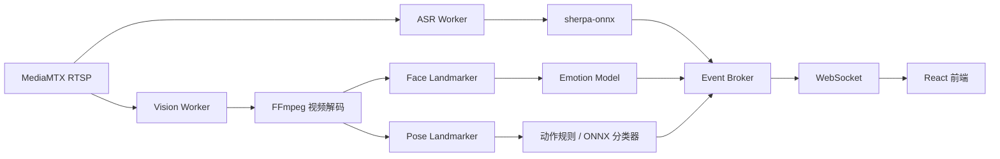

# CPU 环境下的面部状态与动作识别方案

本文为 Live ASR Pose 项目规划一套不依赖 PyTorch、可以在本地 CPU 环境运行，并能接通现有 RTSP、FastAPI、WebSocket 和 React 前端的视觉分析方案。

## 目标

在现有实时语音识别系统上增加：

- 面部关键点检测
- 面部细微动作检测
- 基础情绪分类
- 人体姿态估计
- 常用动作识别
- 统一的实时分析事件协议

当前首先考虑 CPU 实时性和完整链路跑通，未来再迁移到独立 GPU 推理服务器。

## 推荐模型组合

| 功能 | 推荐模型 | 运行方式 | 主要输出 |
| --- | --- | --- | --- |
| 面部细微动作 | MediaPipe Face Landmarker | MediaPipe CPU Runtime | 478 个面部关键点、52 个 Blendshape |
| 基础情绪 | OpenVINO `emotions-recognition-retail-0003` | OpenVINO CPU | 平静、开心、悲伤、惊讶、愤怒 |
| 人体姿态 | MediaPipe Pose Landmarker Lite | MediaPipe CPU Runtime | 33 个二维及三维人体关键点 |
| 动作分类 | 关键点规则 + 小型时序分类器 | Python / ONNX Runtime | 站立、坐下、挥手、行走等 |

MediaPipe 使用 TFLite 模型包，不是 ONNX，但同样不需要 PyTorch，并且专门针对端侧 CPU 实时推理进行了优化。

## 为什么选择 MediaPipe

### Face Landmarker

Face Landmarker 一次推理可以输出：

- 478 个面部关键点
- 52 个面部 Blendshape
- 面部变换矩阵

常用 Blendshape 包括：

- `eyeBlinkLeft`
- `eyeBlinkRight`
- `browInnerUp`
- `browDownLeft`
- `browDownRight`
- `mouthSmileLeft`
- `mouthSmileRight`
- `mouthFrownLeft`
- `mouthFrownRight`
- `mouthPressLeft`
- `mouthPressRight`
- `jawOpen`

利用这些数据可以检测：

- 眨眼
- 皱眉
- 抬眉
- 嘴角上扬
- 嘴角下压
- 抿嘴
- 张嘴
- 左右表情不对称
- 头部转动

相比直接输出一个“开心”或“悲伤”标签，Blendshape 更容易解释，也更适合展示面部的细微变化。

官方文档：[MediaPipe Face Landmarker for Python](https://developers.google.com/edge/mediapipe/solutions/vision/face_landmarker/python)

### Pose Landmarker Lite

Pose Landmarker Lite 输出 33 个身体关键点，包括：

- 肩膀
- 手肘
- 手腕
- 手指
- 髋部
- 膝盖
- 脚踝
- 脚跟

每个关键点包含：

- 归一化二维坐标
- 三维世界坐标
- 可见度
- 存在置信度

这些信息足以实现常见姿态和动作的第一版识别。

官方文档：[MediaPipe Pose Landmarker](https://developers.google.com/edge/mediapipe/solutions/vision/pose_landmarker)

## 关于“微表情”的定义

严格意义上的微表情不是普通的单帧情绪分类。

真正的微表情通常具有以下特点：

- 持续时间很短
- 依赖表情开始、峰值和结束的连续变化
- 对摄像头帧率、脸部清晰度和光线要求较高
- 需要专门的微表情数据集训练
- 普通 25 FPS 视频可能漏掉关键变化

因此，项目第一版建议在界面和接口中使用：

```text
面部状态 / 面部动作
```

而不是直接声称识别出了人的真实情绪。

推荐输出两层信息：

```text
面部动作：皱眉、眨眼、嘴角上扬
推测情绪：开心，置信度 0.72
```

其中“面部动作”来自 Blendshape，“推测情绪”来自情绪模型和连续帧融合。

## 基础情绪模型

推荐使用 OpenVINO Open Model Zoo 的：

```text
emotions-recognition-retail-0003
```

模型特点：

- 输入为 `1 × 3 × 64 × 64` 的 BGR 人脸图像
- 约 0.126 GFLOPs
- 约 2.48M 参数
- 提供 FP32、FP16 和 FP16-INT8 版本
- 输出五类基础情绪

输出类别：

| 索引 | 类别 |
| --- | --- |
| 0 | neutral |
| 1 | happy |
| 2 | sad |
| 3 | surprise |
| 4 | anger |

官方在其 AffectNet 子集上报告的准确率为 70.2%。模型更适合接近正面的人脸，头部偏转最好控制在约 ±15° 内。

官方文档：[emotions-recognition-retail-0003](https://docs.openvino.ai/2023.3/omz_models_model_emotions_recognition_retail_0003.html)

这个模型适合作为辅助判断，不应单独当作严格的微表情识别模型。

### 面部结果融合

推荐将情绪模型和 Blendshape 结合：

```text
情绪模型概率
    +
Blendshape 的连续变化
    +
多帧时间平滑
    =
最终面部状态
```

例如：

```text
happy 概率较高
+ mouthSmileLeft/Right 持续上升
+ browDown 较低
= 开心，置信度 0.81
```

## 动作识别方案

### 第一阶段：关键点规则

从 33 个姿态关键点计算：

- 肩、肘、腕夹角
- 髋、膝、踝夹角
- 手腕是否高于肩膀
- 肩膀和髋部的移动速度
- 身体包围框宽高比
- 连续帧关键点位移
- 身体主轴与水平线夹角

可以先实现以下动作：

- 站立
- 坐下
- 下蹲
- 左手举起
- 右手举起
- 双手举起
- 挥手
- 行走
- 身体倾斜
- 疑似跌倒

示例规则：

```text
右手举起：
right_wrist.y < right_shoulder.y

双手举起：
left_wrist.y < left_shoulder.y
and right_wrist.y < right_shoulder.y

坐下：
膝关节角度较小
and 髋部高度在一段时间内保持稳定

挥手：
手腕高于肩膀
and 手腕在连续帧中多次左右移动

疑似跌倒：
身体主轴快速从垂直转向水平
and 髋部高度快速下降
```

规则方案的优点：

- 不需要训练模型
- 不依赖 PyTorch
- CPU 消耗低
- 结果容易解释
- 可以快速接通完整前后端链路
- 动作类别可以完全按业务定义

### 第二阶段：小型 ONNX 时序分类器

规则方案跑通后，可以收集最近 1～2 秒的姿态数据：

```text
30 帧 × 33 个关键点 × (x, y, z, visibility)
```

然后训练一个小型时序模型：

- MLP
- 1D CNN
- TCN
- GRU

训练可以在其他机器或 GPU 服务器上完成，最终导出为 ONNX。本地环境只安装 ONNX Runtime，不需要 PyTorch。

它可以进一步识别：

- 挥手
- 行走
- 起立
- 坐下
- 转身
- 跌倒
- 鼓掌

关键点时序模型只处理少量数值，不处理完整图像，因此通常比视频动作模型轻很多。

## 为什么暂不使用通用视频动作模型

OpenVINO 提供 `action-recognition-0001`，它可以识别 Kinetics-400 数据集中的 400 类动作。

模型由编码器和解码器组成：

- 编码器单帧约 7.34 GFLOPs
- 编码器约 21.28M 参数
- 解码器接收 16 帧的特征序列
- 每次处理约 1 秒的视频片段

官方文档：[action-recognition-0001](https://docs.openvino.ai/2023.3/omz_models_model_action_recognition_0001.html)

第一版不推荐使用它，原因是：

- CPU 开销明显更大
- 与本地 ASR 同时运行时容易争抢 CPU
- Kinetics-400 类别未必符合项目业务
- 许多结果依赖场景背景
- 输出动作类别难以控制和解释

## 推荐后端架构

视觉推理不应直接运行在 FastAPI 事件循环里，建议使用独立进程：



建议让 MediaMTX 分别为 ASR 和 Vision Worker 提供 RTSP 读取连接。两个 Worker 相互独立，某一个推理任务变慢时不会阻塞另一个任务和 FastAPI。

## Vision Worker 处理流程

```text
RTSP
  │
  ▼
FFmpeg 解码并缩放
  │
  ▼
有界最新帧队列
  ├── Face Landmarker
  │     ├── Blendshape 分析
  │     └── Emotion Model
  │
  └── Pose Landmarker
        └── 动作规则 / 时序模型
              │
              ▼
         多帧平滑
              │
              ▼
        WebSocket Event
```

### 视频解码

建议由 FFmpeg 从 RTSP 解码视频，缩放后通过管道传入 Vision Worker：

```text
fps=10,scale=640:-2
```

视觉分析不需要处理原始 25 或 30 FPS 的每一帧。降低分析帧率可以显著节省 CPU。

### 最新帧优先

队列长度建议设置为 1～2：

```text
生产速度 > 推理速度时：
丢弃旧帧，始终处理最新帧
```

实时分析系统不应该积压所有帧，否则结果会越来越滞后。

### 推荐推理频率

| 任务 | 建议频率 |
| --- | --- |
| Pose Landmarker | 8～12 FPS |
| Face Landmarker | 5～10 FPS |
| Emotion Model | 3～5 FPS |
| 前端结果推送 | 5～10 次/秒 |

情绪变化速度通常慢于姿态变化，因此不需要每一帧都运行情绪模型。

### 多帧平滑

单帧预测容易抖动。推荐使用：

- 最近 5～10 帧滑动平均
- 指数移动平均
- 连续 N 帧超过阈值后再切换状态
- 动作进入和退出使用不同阈值

例如：

```text
连续 3 帧检测到右手高于肩膀 → 进入“右手举起”
连续 5 帧不满足条件 → 退出“右手举起”
```

这种滞回策略可以避免结果在临界位置快速跳变。

## WebSocket 协议

建议新增：

```text
/ws/analysis
```

统一视觉事件格式：

```json
{
  "type": "vision",
  "timestamp": "2026-10-02T08:00:00.000Z",
  "face": {
    "detected": true,
    "emotion": {
      "label": "happy",
      "confidence": 0.81
    },
    "expressions": [
      {
        "label": "smile",
        "confidence": 0.88
      },
      {
        "label": "brow_raise",
        "confidence": 0.63
      }
    ]
  },
  "pose": {
    "detected": true,
    "action": {
      "label": "waving",
      "confidence": 0.86
    }
  },
  "performance": {
    "vision_fps": 9.7,
    "latency_ms": 82
  }
}
```

前端展示：

```text
动作识别
当前动作：挥手
置信度：86%

面部状态
推测情绪：开心
面部动作：微笑、抬眉
置信度：81%
```

## 建议依赖

```text
mediapipe
opencv-python-headless
openvino
numpy
fastapi
```

第二阶段增加：

```text
onnxruntime
```

项目不需要安装 PyTorch。

## 模型目录建议

```text
model/
├── sherpa-onnx-streaming-zipformer-bilingual-zh-en-2023-02-20/
├── face_landmarker/
│   └── face_landmarker.task
├── pose_landmarker/
│   └── pose_landmarker_lite.task
└── emotion/
    └── emotions-recognition-retail-0003/
        ├── model.xml
        └── model.bin
```

未来的小型动作分类器可以放在：

```text
model/action/action_classifier.onnx
```

## 实施顺序

### 阶段一：姿态与规则动作

1. 接入 MediaPipe Pose Landmarker Lite。
2. 从 RTSP 解码 8～12 FPS 视频帧。
3. 实现举手、站立、坐下和挥手规则。
4. 新增 `/ws/analysis`。
5. 接通前端动作展示区域。

### 阶段二：面部动作

1. 接入 MediaPipe Face Landmarker。
2. 输出 Blendshape 原始结果。
3. 实现眨眼、微笑、皱眉、抬眉和张嘴事件。
4. 接通前端面部状态区域。

### 阶段三：基础情绪

1. 接入 OpenVINO 情绪模型。
2. 对检测到的人脸进行裁剪和对齐。
3. 融合情绪概率与 Blendshape。
4. 增加多帧平滑和置信度阈值。

### 阶段四：ONNX 时序动作模型

1. 保存姿态关键点序列和动作标签。
2. 使用收集的数据训练小型时序模型。
3. 导出 ONNX。
4. 使用 ONNX Runtime 替换或补充规则分类器。

## 风险与限制

### 面部分析

- 光线不足会降低人脸关键点稳定性。
- 侧脸和遮挡会降低情绪模型准确率。
- 眼镜、口罩会影响部分 Blendshape。
- 模型输出不能证明用户真实的心理状态。

### 姿态分析

- 人体没有完整进入画面时，部分动作规则会失效。
- Pose Landmarker 更适合单人场景。
- 摄像头角度变化会影响基于二维坐标的规则。
- 跌倒检测需要较长的时间窗口，不能只看单帧。

### 性能

- ASR、H.264 转码和视觉推理会竞争 CPU。
- 应使用独立 Worker 进程隔离推理任务。
- 必须限制视觉分析帧率。
- 必须使用最新帧优先策略，避免推理积压。

## 最终建议

第一版采用：

```text
MediaPipe Pose Landmarker Lite
+ MediaPipe Face Landmarker
+ OpenVINO Emotion Model
+ 规则动作分类器
+ 独立 Vision Worker
```

这套方案的优势是：

- 不需要 PyTorch
- 可以在本地 CPU 运行
- 模型体积较小
- 能快速接通完整链路
- 结果容易解释和调试
- 可以逐步替换为 ONNX 时序分类器
- 未来迁移 GPU 服务器时无需修改前端协议

